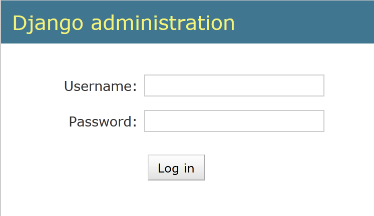
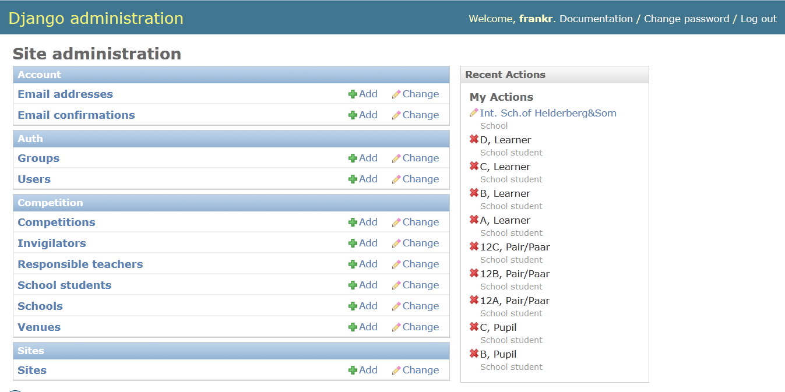
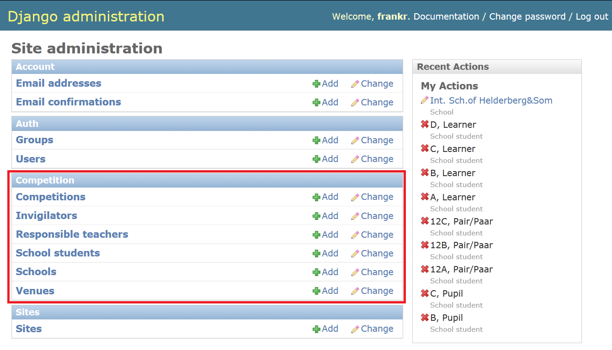
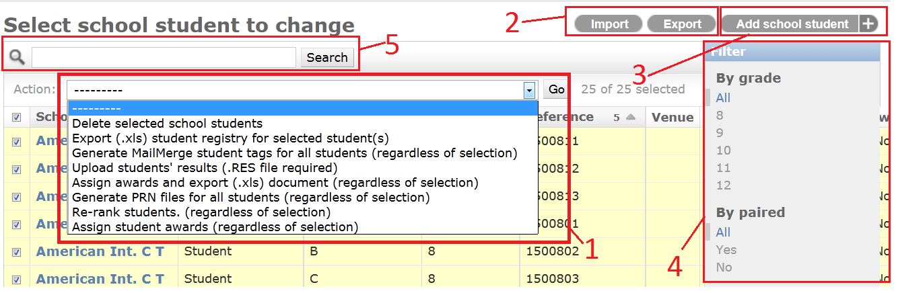
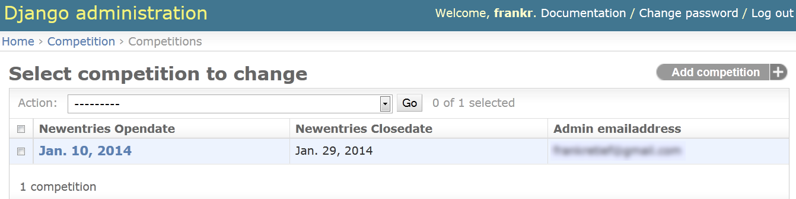
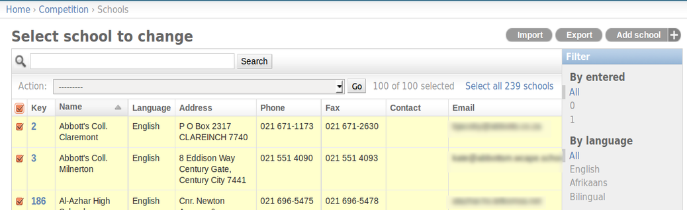
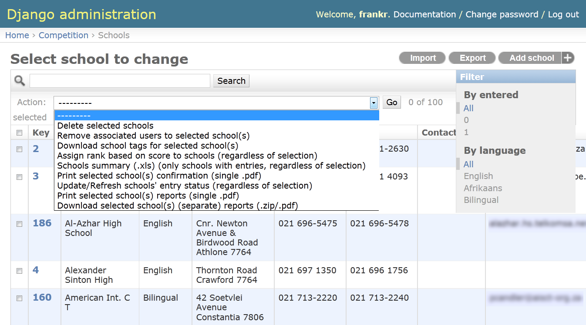
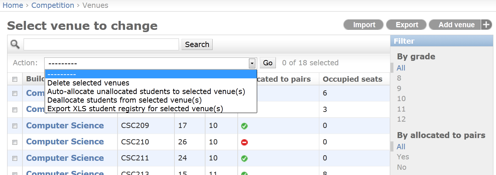

=====================
The Admin Interface
=====================

Logging in
---------------------

As mentioned before, the login page for the administrator is different from that of the teachers'. By going to *uctmaths.sjsoft.com/admin*, you will be presented with the login page shown here. 

    The basic login page for the administrator

.. note:: You can also log in as a teacher using your admin username and password at the teachers' interface.

Base admin page
--------------------

Once logged in, you will see the administration overview page. By clicking on any of the entity links (eg. School students), you will be presented with a table containing all the records for that entity.

    The administrator overiew page is the first you will see after login. It contains links to the different archives of information available to the admin.

The following sections introduce each of the important links that can be followed from this page. Please pay attention to the guidelines and warnings about its usage. While the website is tested and robust, manipulating values as an administrator can have unintended side effects.

The table is divided into 4 sections:

1. **Account** contains user information regarding email addresses.

2. **Auth** contains the users signed up to your website. This is where you will likely go to manage access to the site.

3. **Competition** is where most of the useful information is. This is where the information that the teachers enter will be shown as well as extra information about schools and venues.

4. **Sites** isn't used. Don't change anything here.

Auth
--------------------
**Users** in this section contains the users signed up to the UCT Mathematics Competition website. You can see their log in username, email address and staff status. 

.. warning:: This is **not** where you want to edit which user is associated with a school. If you delete a user here without removing the user's association with a school (on the Schools page), you could end up deleting the school's entry in the database too!

==========================
Competition Administration
==========================

The following sections relate to the ''Competition'' section of the Admin. home page.

    This section of the document refers specifically to the links in the ''Competition'' section (shown in red)

    Actions, filters and searches can be performed on the entries in the table. 

An example of a table is shown above. **1** shows the actions that can be performed on a selection of the information. 

.. note:: Some options contain "selected student(s)" in their description where others contain "regardless of selection". While the former is obvious, the latter can cause confusion. The website framework expects that at least one item is selected for an action to run. So an action that acts "regardless of selection" still requires that at least 1 item be selected by the user. 

**2** shows the import and export functions. Feel free to play with these as they can be very useful. **3** is the link that you can use to create a new entry for the table. Please read the sections below before you do as there are some non-obvious fields and some fields that shouldn't be filled out by the admin. **4** is the Filter sidebar. This can be used to remove some results from being displayed in the table. (eg. show only paired students). **5** is a search field where you can enter, for example, the name of a school whose entry you wish to find. 

.. note:: Clicking the checkbox on the left to select all entries (shown below) will only select all the students **on that page.** Remember to click "Select all X entries" to select all of the entries in the table.
    

    .. figure:: images/admin_selection.png
        :width: 85%
        :align: center
        :figwidth: 95%

        Be careful when trying to select all students, you may only be selecting those in the current view!

Competitions
--------------------

Competitions is where you can edit details of the competition. These details will be posted on the website and control when teachers can sign up their schools. 

    You should always ensure that there is only one entry on this page. This Competition entry contains the dates for closing online entries and the administrator's details to be posted on the site.

The options that can be edited are:

.. table:: Competition administration

   ===============================  ============================================================
     Field                          Description
   ===============================  ============================================================
   New entries open date            When teachers can start signing up students
   New entries close date           When online entries close (last allowable day of sign-up)
   Admin. email address             CC'd on all confirmation emails; teachers are directed here for help
   Num. school candidate scores     Number of top scores that are added to produce school score
   Num. of individuals              Maximum number of individuals per grade
   Num. of pairs                    Maximum number of pairs per grade
   ===============================  ============================================================

.. note:: The administrator email address you enter will be publically available to all teachers requiring help signing up. It may be a good idea *not* to use your home or personal email address.

.. warning:: The last 3 fields in the table have been included to allow customisation of the competition at a later date. Please remember to set them correctly **before** allowing any sign-ups.

Responsible teachers and Invigilators
-------------------------------------

The names and contact details of the Responsible Teachers and Invigilators are kept in these two tables. If you would like to export invigilator and responsible teacher information, click the 'Export' button on the top right corner of the *Invigilators* page. This will export all the Invigilators' data with the contact details for the Responsible Teacher for each respective invigilator in the same row. 

Schools
--------------------

The Schools table is (already) populated with schools recognised by the UCT Mathematics Competition. 

    The Schools page presents the schools that exist in the database.

Each school record can be individually edited. You would come here to edit the name or contact details of the school, or to remove a user's association with the school. A description for each of the fields is shown in the table below. 

.. table:: School entity fields

   ===============================  ============================================================
     Field                          Description
   ===============================  ============================================================
   Name                             The school's name (required)
   Key                              A unique key identifying the school (required)
   Language                         The preferred language (required)
   Address                          Address of the school (required)
   Phone                            Phone number
   Fax                              Fax number
   Entered                          Does the school have entries (1 - yes, 0 - no)
   Score                            The sum of the top students at the school
   Email                            Email contact address for the school
   Assigned to                      Which username the school is assigned to
   Rank                             Ranking of schools based on score
   ===============================  ============================================================

The non-obvious fields (ie. **Entered**, **Score**, **Assigned to**, **Rank**) are used by the background methods to produce lists and should not be filled in by the admin. However, **Entered** should be set to 0 as it is required when creating a new school. **Rank** and **Score** are calculated by the database once the scores of the students are known.

The **Assigned to** field is completed by the database when a teacher selects the school for which they are to be responsible.

.. caution:: The school's name should not contain a '/'. This can cause odd behaviour down the line. Rather use an '&'.

.. warning:: Please ensure that a user is only ever assigned to **one** school at a time. This is very important. Best practice would be to only **remove** a user's association to a school from this interface. (ie. set **assigned to** to '--------')

Searches and filters
~~~~~~~~~~~~~~~~~~~~
The blue bar on the right of the window contains a number of customisable filters. (They're pretty self-explanatory)

    The drop-down menu shows the possible exporting functions available to the administrator.

Actions and exports
~~~~~~~~~~~~~~~~~~~~

- **Remove associated users to selected school(s)**

        As has been introduced earlier, each school is associated with one username. This method allows that association to be cleared for a selection of schools. This can also be done individually for each school.

        *Example use-case:* preparing the competition for a new year, removing all user-school associations in the database

- **Download school tags for selected school(s)**

        For a selection of schools, a single Mailmerge-formatted file is produced for school labels. 

        *Example use-case:* preparing name tags for all the schools that have entered. By using the **Entered** filter on the right to remove schools without entries, the remainder can be selected and name tags for only those schools can be generated.

- **Assign rank based on score to schools (regardless of selection)**

        Based on the students' scores, the top students (the number of which is defined by the Competition entity) are summed to generate a score for the school. Schools with equal score are ranked the same. 

        *Example situation:* there are three schools. A and B score 10 and C scores 9. This method will cause A and B to be ranked 1st and  will be ranked 3rd.

- **School sumary (.xls) (only schools with entries, regardless of selection)**

        Generates a two-sheet Excel document that summarises the entry of each school. The school's name; the name and contact details of the responsible teacher; the number of individuals and pairs entered for each grade; and the total number of students entered by each school. The second sheet contains additional results information.

- **Print selected school(s) confirmation (single .pdf)**

        Generates for download a single (.pdf) document containing the confirmation emails for the selected schools.

- **Update/Refresh schools' entry status (regardless of selection)**
        
        This method checks all schools for entries and sets the **Entered** field for each school. While this is done when teachers submit their entries, this method is a useful check to run if you have made any changes to via. the admin interface (something that is discouraged).

- **Print selected school(s) reports (single .pdf)**

        Once students' scores have been entered into the system, school reports can be generated. See example sheet.
    
        *Example use-case:* when the school reports have to be printed and posted. This method will generate a single file with all reports which is easier to print.

- **Download selected school(s) (separate) reports (.zip/pdf)**

        Once students' scores have been entered into the system, school reports can be generated. This method generates a separate file for each school report.

        *Example use-case:* when the school reports have to be emailed. You will be promped to download a .zip archive which will contain a file for each school. These can then be easily attached to individual emails for each school.

School students
--------------------

Actions and exports
~~~~~~~~~~~~~~~~~~~~

- **Export (.xls) student regstry for selected student(s)**

    This action will generate an excel spreadsheet for the selected set of students. The spreadsheet is split into 10 sheets which list the pairs and individual student entries for each grade.

- **Generate MailMerge student tags for all students (regardless of selection)**

    A .zip archive file is generated containing the files required for the MailMerge program. The names and formatting of the student entries and  file names is based on examples from previous years.
        
- **Upload students' results (Ranked.csv file required)**

    Allows the upload of student results files to the database. Errors are presented to the user on the page after upload has taken place.

    .. note:: The file names are expected to be those as seen in the example files. (eg. "GR8 IND Ranked.csv" for INDividuals in grade 8 or "GR8 PRS Ranked.csv" for Pairs in grade 8.)

- **Assign awards and export (.xls) document (regardless of selection)**

    This action will generate an Excel spreadsheet containing the Gold and Merit awards for each grade. The Oxford School Award is also assigned to students who score the highest at their school (regardless of grade or if they're a pair or not) if their school has not received any gold awards.

    .. note:: This method uses the **Rank** of the student. Please ensure that ranks have been assigned to the Students before using this method. If you require, there is a ''Re-rank students (regardless of selection)'' method that will use the Students' scores to assign them a rank.

- **Generate PRN files for all students (regardless of selection)**

    Generates a .zip archive with the PRN files for each grade and pairing status. The files generated are based on format from previous years' competitions. 

- **Re-rank students (regardless of selection)**

    Assigns ranks to all students based on their score. 
    
    .. note:: The ranks are imported when a Ranked.csv file is uploaded. However, if you wish to manually disqualify a student, you can delete their score (leave the field blank - which is equivalent to an 'ABSENT') and then use this function to re-rank the remaining students.

- **Assign awards (regardless of selection)**

    Assigns awards to all students based on their rank. This method will populate the students' **Award** column with the relevant award. The top 10 individuals and top 3 pairs in each grade will be awarded Gold ('G'). From the remaining students, the top 200 individual and top 100 pairs will be awarded Merit ('M'). The Oxford School Prize ('OX') is awarded to the top student rank in a school that has not received any Gold awards. Note that 'MOX' is a student that has received Merit and the Oxford School Prize. 

    This requires that students' **Rank** field is not empty. (It will ignore those with an empty **Rank**)

Venues
------

Venues are largely configured by the administrator of the system; the **Allocated seats** field is the only one that is handled by the system. 

When creating a new venue, please be sure to set the **Occupied seats** field to 0. This value is used when the auto-allocate action takes place. 

The actions available to the admin to perform on Venues are:

- **Auto-allocate unallocated students to selected venue(s)**

    Students without a current venue alocation will be assigned to the selected venue(s). Each student record will be updated according to which venue they are placed in. 
    
- **De-allocate students from selected venue(s)**

    Students in each selected venue will be de-allocated. That is, the number of Occupied Seats in the Venue will be set to 0 and the Student records will be updated.

- **Export (XLS) student registry for selected venue(s)** 

    Generates student registry for the selected venue(s). 

.. note:: If you do not want a venue to be used during the allocation process, make sure that **Grade** is set to *None* by selecting '---------' in the drop-down menu of a Venue object. 

.. caution:: When using these allocation algorithms, please ensure that all students have been assigned to venue. For example if there are not enough venues for the number of students, the remaining students will have a blank **Venue** field in the *School student* table. It is easy to see if there are any unallocated students by going to the *School student* table from the admin interface and sorting by **Venue** by clicking on the column heading.
