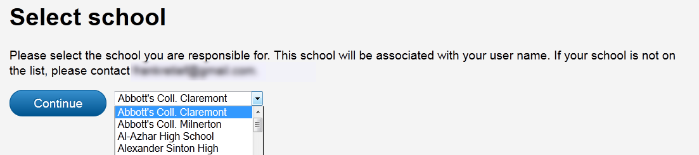
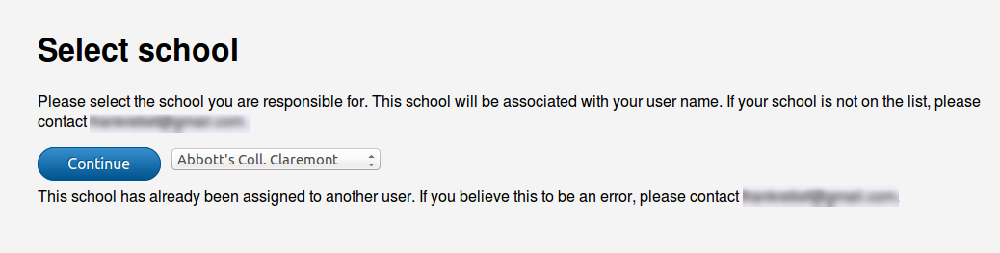
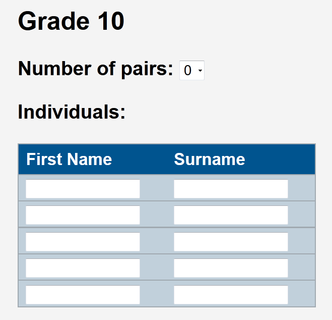
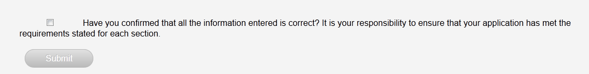
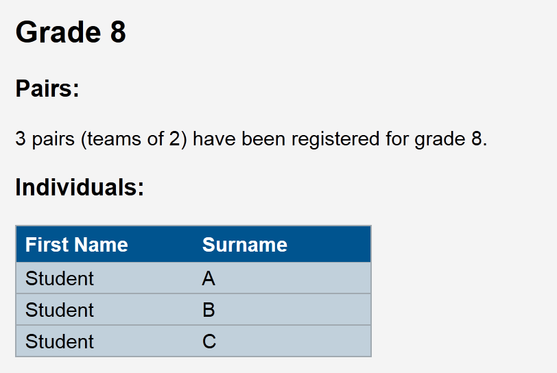
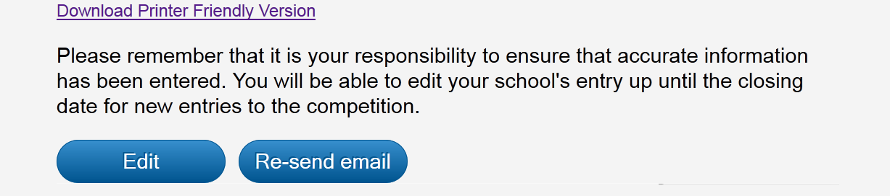

=======================
Teacher's Interface
=======================

This section will provide information on the process of signing up students using the teacher's interface at *uctmaths.sjsoft.com*. 

The 'Admin. Interface' section of this documentation goes into more detail about how users are associated with schools. For now (assuming you are reading this section first), it is just important to know that a user is associated with a single school. Once they have chosen which school they are to be responsible for, they will  have sole access to that schools entry form.

Logging in
----------

.. figure:: images/teacher_login.png
    :width: 65%
    :align: center
    :figwidth: 75%

    The log-in/landing page for teachers

This login page is the first seen by teachers when they go to the site. It allows a teacher to log in with their username and password, sign up or recover a forgotten password. Once logged in, the teacher will be taken to the **Profile** page.

The Profile page
----------------

After having logged on, a teacher will be taken to the **Profile** page. This page provides information on the user (ie. school association or lack thereof)  and on the competition (ie. closing date or if online entries for the competition are closed)

A teacher will not yet be associated with a school the first time they log in. The blurb on the **Profile** page will inform them of this and direct them to the **Entry form** link where they will first select a school.

.. figure:: images/teacher_profile_notassociated.png
    :width: 85%
    :align: center
    :figwidth: 95%

    A teacher is not currently associated with any school

Selecting a school
------------------

A school is associated with a single user. On their first log in, users will be prompted to choose the school that they are responsible for. If a teacher chooses the wrong school by mistake (they cannot undo this themselves), or they find that another user has taken the school, they will be prompted to email the administrator.

    The user will be asked to select a school from the drop down menu.

    If the school has already been associated with another username, the teacher will be prompted to contact the administrator.

.. note:: As the administrator, you will have to navigate to the Schools tab, find the school and then change the **Assigned to** drop-down field to "---------" (meaning that no user has been assigned to it). See the Administrator Actions section of this report for more details.

Completing and submitting the form
-----------------------------------

The main registration form requires the user enter data into text fields. The teacher is required to enter:

- a responsible teacher's name and contact details;

- up to 10 invigilators (name and contact detals);

- up to 5 individuals (name and surname) and up to 5 pairs (drop down menu) per grade.

    An example of an empty section for grade 10. The pair entries are chosen via the drop down menu and the individuals' names and surnames are entered into the text fields below.

Once the teacher has filled in the form, they have to click on a checkbox (placing the responsibility on them to ensure the accuracy of their entrance.)

    The **Submit** button remains greyed out until the checkbox is clicked.

Finally, once the box has been checked and the form is deemed valid, the user will be able to click **Submit**. At this point, an email with a summary of the teacher's entry will be emailed to the address associated with their username. An email will also be sent to the administrator's email address, notifying the admin of a new or ammeded entry to the competition. 

Edit and review
---------------

Once a teacher has successfully made an entry to the competition, their entry will be shown when they navigate to the **Entry form** page. (As shown here).

    The teacher can view the information already submitted for the school. The number of pairs and the details of the individuals are shown but not directly editable.

If online entries are still open, the teacher will be able to edit the entry or re-send the confirmation email. If the deadline for online entries has passed, the teacher will only be able to re-send the confirmation email.

